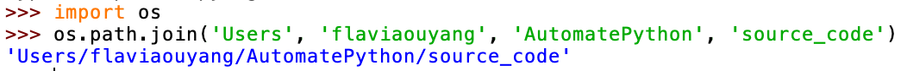
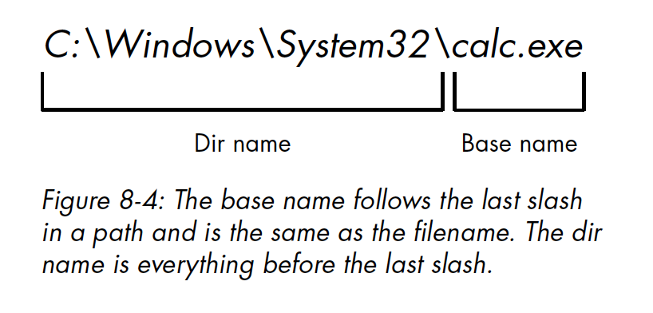

# Automate the boring stuff with Python

- Run python in terminal `python3 filename.py`
- Run python in VSC `shift + 1`

***

## Chapter One: Python Basics

- Math Operator

  ```python
  ** #exponent
  % #modulus/remainder
  // #integer division/floored quotient
  ```

- Variable naming convention: `snake_case`

- Typecasting: `str(100)`,`int("100")`,`float(100)`

---

## Chapter Two: Flow Control

- Comparison Operators

```python
== # equal to
!= # not equal to
```

- Boolean Operators

```python
True and True # True
True and False # False
False and True # False
False and False # False
# there is no bool(input()) in Python
```

- if statements

```python
if condition == "True":
  print ("This code block will run.")
 print("If condition is false, the code block above will not run.")

if password == "Flavia is great":
  print("Access Granted")
else:
  print("Access Denied")
  
if sex == "female":
  print("Welcome")
elif sex == "non-binary":
  print("Come on in")
elif sex == "male":
  print("Get the fuck away")
else:
  print("Please await assisstance")
```

- While loop

```python
while counter < 10:
  print ("Hello, there!")
  counter += 1
```

- break statement

```python
while True:
  print("enter your name\n")
  name = input()
  if name == "Flavia":
    break
print ("Thank you")
```

- continue statements

```python
# continue statements are used inside loops
# when reaches a continue statement, the program execution jumps back to the start of the loop and reevaluates the loop's condition

while True:
  code = input("What is the code word?")
  if code != "cactus"
  	continue
  else:
    print("Welcome")
  	break
print("You're in.")
```

- for loop
- `range()`

```python
for i in range(12, 16):
  print(i)
# 12 13 14 15
for i in range(0, 10, 2):
  print(i)
# 0 2 4 6 8
for i in range (5, -1, -1):
  print(i)
# 5 4 3 2 1 0
```

- importing modules: `import`statement composed of `import`, the name of the module, comma, and more modules names (optional)

- Ending a Program Early: `sys.exit()`

  - terminate a program by calling `sys.exit()` 
  - since this function is in `sys`module, you have to import `sys`before your program can use it

  ```python
  import sys
  while True:
    response = input("Enter \'exit\' to exit.")
    if response == "exit":
      sys.exit()
     print("Your response is " + response)
  ```

---

## Chapter Three: Functions

- A *function* is like a min-program within a program

```python
def hello():
  print("Howdy!")
  print("Hallo!")
  print("Salut!")
```

- The first line is a `def`statement which defines a function's name

- code block that follows `:` is the body of the function
- The code is executed when the function is called, not defined
- The `none`value:
  - represents the absence of a value
  - `None` is the only value of the `NoneType`data type
- `print()`function

```python
print("Hello". end="")
print("World")
# HelloWorld
print("cats", "dogs", "mice", sep="-")
```

- Local and Global Scope
  - Parameters and variables that are assigned in a called function are within that function's *local scope*.
  - Variables that are assigned outside all functions are within in the *global scope*.
- Exception Handling
  - an error or *exception* means that the entire program will crash
  - Errors and can be handled with <strong>try and except</strong> statements
    - code that can potentially have an error is put in a **try** clause
    - Program moves to the start of a **except** clause if an error happens

```python
def division(denominator):
  try:
    return 100/denominator
  except ZeroDivisionError:
      print ("Error: Invalid argument.")
```

---

## Chapter four: Lists

- The *List*  Data Type:
  - *List* is a value that contains multiple values in an ordered sequence
  - `list=['a', 'list', 'looks', 'like', 'this']`
  - Values inside the list is called **items**, and items are separated with **commas**.
- Getting individual values in a list with Indexes
  - 
  - Python will give an `IndexError`message if an index exceeding the number of values in your list values is given
  - Index can only be integer values, not floats. Otherwise, a `TypeError`will be thrown.
  - Lists can also contain other list values.
  - Negative Indexes: `-1`refers to the last index in a list, so on and so forth
- Getting Sublists with Slice
  - `list[1:10]`
- Getting a list's length with `len()`
- List Concatenation and List Replication
  - `+`operator can combine two lists to create a new list value
  - `*`operator can replicate the list `x`amount of time
- Romving vlues from lists with `del`statements
  - `del`statement will delete values at an index in a list
  - all the values in the list after the deleted value will be moved up one index
  - `del list[index]`
  - `del list` will delete the entire variable 
    - if you try to use the variable after, you will get a `NameError`error
- Working with Lists
  - to avoid using multiple and repetitive variables, you can use a single variable that contains a list value
- `in` and `not in`operators
  - `'cat' in list` or `'boy' not in list`
- Multiple Assignment Trick:
  - `cat=['black','old]`
  - `color = cat[0]`and `age = cat[1]`
  - or you can write `color, age = cat`
  - if the number of variables and the length of the list is not **exactly the same**, a `ValueError`will be thrown.
- Methods: a *method*  is the same thing as a function, except it is "called on" a value.
  - finding a value in alist with the `index()`method
    - `list.index('item')` >>> `2`
    - if the value isn't in the list, a `ValueError`is thrown
    - when there are duplicates in the list, the first appearance is returned
  - adding values to lists with `append()`and `insert()`methods
    - `append('value')`adds to the end of the list
    - `insert(index, 'value')` insert a value at any index
    - both methods can only be used on list values
  - removing values from lists with `remove()`
    - `list/remove('value')`
    - if there are duplicates, <u>only the first instance</u> of the value will removed
  - sorting the values in list with the `sort()`method
    - `list.sort()` will sort numbers in ascending order and string values in ASCIIbetical order (uppercase before lowercase)
    - `list.sort(reverse=True)`
    - you cannot sort lists with multiple data types
    - `list.sort(key=str.lower)`will sort in a regular alphabetical order
- List-like types: Strings and Tuples
- Mutable and Immutable Data Type:
  - Mutable (it can be modified): list
  - Immutable (it cannot be reassigned/rearranged): string
- Tuple: almost identical to list, except that
  - tuples are enclosed with parentheses `()`
  - tuples are immutable
    - no modifying values
    - no appending
    - No removing
  - if there is only one value in a tuple, you must add a trailing comma to indicate that it is a tuple not a string
  - Typecasting: `tuple(list)`
- References
  - When you assign a list to a variable, you are assigning a list *reference* to the variable. 
  - A reference is a value that points to some bit of data and list reference is a value that points to a list
  - Therefore, if you change the list through one reference, the lists changes

```python
dog = ['doberman', 'golden', 'corgi']
dog_1 = dog
dog_1[1] = 20
print (dog)
print (dog_1)

# ['doberman', 20, 'corgi']
# ['doberman', 20, 'corgi']
```

- The copy Module's `copy()`and `deepcopy()`functions
  - first `import copy`
  - `copy.copy(list)`can be used to make a duplicate copy of a mutable value (list or dictionary) not just a copy of reference
  - if the list needs to be copied contains lists, then use `copy.deepcopy()`

---

## Chapter Five: Dictionaries And Structuring Data

- **Dictionary** data type: a collection of many values
	- unlike lists, indexes can be anything not only integers
	- index for dictionary is called **key**
	- A key with its associated value is **key-value pair**
	- Code below assigns a dictionary to `myCat`variable, the `keys` are `size, color,disposition` and `values`are `'big','gray','loud'`

```python
myCat = {'size':'big', 
         'color': 'gray',
         'disposition':'loud'}
```

- Dictionaries vs. Lists

	- items in dictionaries are unordered
	- dictionaries cannot be sliced like lists
	- access a key that does not exist will result in a `KeyError` message

- `keys(), values(), and items()`Methods

	- `dic_name.key()`
	- they are not lists
	- `dic.item()` returns tuples of key and value
	- use `list()` to transform output to list

- Checking if a `key/value`exist in a Dictionary

	- use `in` or `not in` operator

	```python
	print('big' in cat)
	# output:
	# False
	
	print('size' in cat)
	# output:
	# True
	
	print('big' in cat.values())
	# output:
	# True
	```

- `get()`: takes two arguments

	1. key of the value to retrieve
	2. a fallback value to return if that key does not exist

```python
print("The cat is ", cat.get('size', 'undetermined in terms of size'), ".")
# output:
# The cat is  big .

print("The cat is ", cat.get('breed', 'undetermined in terms of breed'), ".")
# output:
# The cat is  undetermined in terms of breed .
```

- `setdefault()`method:
	- set a value for a certain key if that key does not already exist
	- first argument passed: the key to check for
	- second argument passed: the value set at that key if key DNE
	- if key does exist, the method returns the key's value
- Pretty Printing
	- `import pprint`
	- `pprint.pprint()`
	- `pprint.pformat()` gives the prettified text as a string value
- Using Data Structures to Model Real-World Things 
	- Tic-Tac-Toe Board
- Nested Dictionaries and Lists

---

## Chapter Six: Manipulating Strings

- String Literals

	- double quotes `foo = "this is a string"`

	- escape characters `foo = 'say hi to Nat\'s mother'`

		1. `\s` single quote
		2. `\"` double quote
		3. `\t` tab
		4. `\n` new line
		5. `\\` backslash

	- raw strings: place `r` before the beginning of quotation mark and make it a raw string

		- **a raw string** ignores all escape characters

	- multiline strings with triple quotes

		```python
		print('''Dear Austyn,
		
		I love you more and more each day.
		
		Sincerely,
		Flavia
		''')
		```

	- multiline comments

	```python
	"""this is a multiline comment
	in python
	interesting, right?"""
	```

	- Indexing and Slicing Strings

		- 

		- ```python
			spam = 'Hello world!'
			spam[0] = 'H'
			```

	- `in` and `not in` Operators with Strings

		- ```python
			>>> 'hello' in 'hello world'
			True
			```

- Useful String Methods

	- `upper(), lower(), isupper(), islower()` string methods
	- they do not change the string itself, just return new values

- `isX()`String methods

	1. `isalpha()`: True if only letters and not blank
	2. `isalnum()`: True is only letters and numbers and not blank
	3. `isdecimal()`: True is only numeric characters and not blank

- `startswith()` and `endswith()`string methods

	- return `True` if begin or ends with string passed

- `join()` and `split()`

	```python
	a = 'apple'
	b = 'banana'
	c = 'cucumber'
	d = 'deck'
	
	print(', '.join([a, b, c, d]))
	
	quote = 'Someone will remember us, I say, Even in another time'
	
	print(quote.split(', '))
	```

- Justifying Text with `rjust()`, `ljust()` and `center()`

	- `rjust() and ljust()`return a padded version of the string

		- first argument is an integer length for the justified string

		- ```python
			print(a.rjust(30))
			print(a.ljust(10))
			```

		- `center()` works the same

- removing whitespace with `strip(), rstrip() and lstrip()`

- Copy and Paste with `pyperclip` Module

```python
import pyperclip
pyperclip.copy("foo")
pyperclip.paste
```

---

## Chapter Seven: Pattern Matching with Regular Expressions

- **Regular expressions**, called *regexes* for short, are descriptions for a pattern of text.

	- `\d` in a regex stands for a digit character (0-9)
	- adding a number in curly bracket `{num}` after a pattern will repeat that pattern `num` times

- Creating Regex Objects

	- All regex functions in Python are in the `re` module 
	- `import re`
	- Passing a string value representing your regular expression to `re.compile()`returns a *Regex* pattern object

	```python
	phoneNumRegex = re.compile(r'\d\d\d-\d\d\d-\d\d\d\d')
	# phoneNumRegex variable contains a Regex object
	# r in front of '' because passing raw string is easier
	```

- Matching Regex Objects

	- A Regex object's `search()`method searches the string it is passed for any matches to the regex
	- `search()`return `None`if the regex pattern is not found in the string
	- if a pattern is found, the `search()` method returns a `Match`object
	- `Match`objects have a `group()`method that will return the actual matched text from the searched string

	```python
	phoneRegex = re.compile(r'\d\d\d-\d\d\d-\d\d\d\d')
	num = phoneRegex.search(message)
	print(num.group())
	```

	- Review of Regular Expression Matching
		1. import regex module `import re`
		2. Create a regex object with `re.compile()` function, use a raw string
		3. pass the string you want to search into the regex object's `search()` method. this will return a Match object
		4. Call the Match object's `group()`method to return a string of the actual matched text

- Grouping with Parentheses: 

	- adding parentheses will create *groups* in the regex: `(\d\d\d)-(\d\d\d\d)`

	- then use `group()`match object method to grab the matching text from just one group

		- First set of parentheses in a regex string will be group 1, adn so on
		- Pass integer to `group()`match object method, you can grab different parts of the matched text
		- pass nothing or 0 will return the entire matched text

		```python
		>>> phoneNumRegex = re.compile(r'(\d\d\d)-(\d\d\d-\d\d\d\d)')
		>>> mo = phoneNumRegex.search('My number is 415-555-4242.')
		>>> mo.group(1)
		'415'
		>>> mo.group(2)
		'555-4242'
		>>> mo.group(0)
		'415-555-4242'
		>>> mo.group()
		'415-555-4242'
		```

		- to retrieve all groups at one, use `groups()`method

			- this will return a tuple of values

			```python
			>>> mo.groups()
			('415', '555-4242')
			>>> areaCode, mainNumber = mo.groups()
			>>> print(areaCode)
			415
			>>> print(mainNumber)
			555-4242
			```

		- how to handle parentheses in text: escape the parentheses `\(\)`

- Matching Multiple Groups with the Pipe

	- `|`is called a *pipe*: use it anywhere you want to match one of many expressions

		- `r'Batman|Tina Fey'` will match either 'Batman' or 'Tina Fey'
		- When both searched terms occur in the searched string, the first occurence of matching text will be returned as the Match object

	- use pipe to match one of several patterns as part of regex

		- You want to match any of 'batman', 'batmobile', 'batcave'

		```python
		batRegex = re.compile(r'bat(man|mobile|cave)')
		mo = batRegex.search("batman is cool")
		mo.group()
		# batman
		mo.group(1)
		# man
		```

- Optional Matching with the Question Mark

	- The `?`character flags the group that precedes it as an optional part of the pattern

	```python
	batRegex = re.compile(r'bat(wo)?man')
	mo = batRegex.search("batman is the best")
	print(mo.group())
	
	mo1 = batRegex.search("batwoman is the best")
	print(mo1.group())
	
	mo2 = batRegex.search("batwoman is better than batman ")
	print(mo2.group())
	
	mo3 = batRegex.search("batman is better than batwoman")
	print(mo3.group())
	
	# Print Output:
	# batman
	# batwoman
	# batwoman
	# batman
	```

	

- You can find *all* matching occurrences with `findall()` method

```python
murphyRegex = re.compile(r'Endon|Murphy')
mur = murphyRegex.search(quote)
print(mur.group())
print(murphyRegex.findall(quote))
```

- Matching ZERO or More with the Star

	- `*` means match zero or more: the group preceding `*` can occur any number of times. It can be absent or repeated 10,000 times.

	- ```python
		batRegex = re.compile(r'bat(wo)*man')
		# mo = batRegex.search('batman is cook')
		mo = batRegex.search('batwowowowowowoman is cook')
		print(mo.group())
		```

- Matching One or More with Plus sign

	- `+` means match one or more: the preceding group must appear at least one time

	- ```python
		batRegex = re.compile(r'bat(wo)+man')
		mo = batRegex.search('batman is cook')
		# mo = batRegex.search('batwowowowowowowowoman is cook')
		print(mo.group())
		
		#output:
		Traceback (most recent call last):
		  line 102, in <module>
		AttributeError: 'NoneType' object has no attribute 'group'
		```

- Match Specific Repetitions with Curly Brackets

	- a number in curly brackets will repeat the preceding group a specific number of times
	- `(Ha){3}` will match `'HaHaHa'`
	- You can also specify a range by writing a minimum, a comma, and a maximum in between the curly brackets like `(Ha){3, 5}`
	- You can also leave out a number to make it unbounded like `(ha){3,}`will match 3 or more and`(ha){,5}`will match 0 to 5 instances

- Greedy and Nongreddy Matching

	- Python's regex are *greedy* by default: in ambiguous situation it will match the longest string possible
	- *non-greedy* version will match the shortest string possible

- `findall()` Method

	- return the strings of every match in the searched string
	- Unlike `search()`, `findall()` doesnt return a *Match* object but a list of strings, **as long as there is no group**
	- If there *are* groups, `findall()` will return a list of tuples

- **Character Classes**

	- shorthand codes for common character classes

	```python
	\d # numeric digit from 0 to 9
	\D # character that is not a number digit from 0 to 9
	\w # any letter, numeric digit or underscore
	\W # any character that is not a letter, numeric digit or the underscore
	\s # any space, tab or newline character
	\S # any that is not a space, tab or newline
	```

- Making your own character class

	- define your own character class with `[]`
	- for example `[aeiouAEIOU]` will match any vowel, lowercase and uppercase
	- You can also include ranges of letters or numbers using hyphen `[a-zA-Z0-9]`
	- Inside `[]`, you don't need to escape `\`
	- `^` will create a negative class
		- it will match all character that is **not** in the class
		- `[^aeiouAEIOU]`

- Caret and Dollar SIgn Characters
	- `^` at the start of a regex to show that a match must be at the *beginning* of the searched text
	- `$` at the end of the regex to show the string must end with this regex pattern
	- combine `^` and `$` together, you can show you need the entire string to match the exact regex pattern
	- **Carrots costs dollars** to remember caret comes first
- Wildcard character
	- `.` will match any character except for a newline
	- it will match only one character
- **Matching everything** with Dot star
	- Dot-star works in *greedy mode* that it will match as much text as possible
	- to switch to *non-greedy*, use dot, star, and question mark `.*?`
- Matching Newlines with Dot
	- pass `re.DOTALL`as a second argument to `re.compile()` will match *all* characters including newline


- **Case-insensitive** matching
	- regex are usually case-sensitive
		- Pass `re.IGNORECASE` or `re.I` as a second argument to `re.compile` will make it case insensitive
- Substitute Strings with `sub()` Method
	- `sub()` gets passed two arguments
		1. a string to replace any matches
		2. the string for the regular expression
	- the methods returns a string with all the substitution applied
- Matching Complex Regexes
	- ignore whitespace and comments with the **verbose mode**
		- Pass `re.VERBOSE` as a second argument to `re.compile()`
- Combine `re.IGNORECASE`, `re.DOTALL` and `re.VERBOSE`
	- `re.compile()` only takes a single value as its second argument
	- However, you can still use them together with `|` the pipe character or in this context known as *bitwise or* operator
	- `someRegex = re.compile('/d', re.IGNORECASE | RE.DOTALL)`

---

## Chapter Eight: Reading and writing files

### Files and file paths

- file has two key properties:
	- *filename*
	- *path*: specifies the location of a file on the computer

### Forward slash on OS X

- Backslashes `\` is the separator between folder names on Windows
- Forward slash `/` is the separator on OS X and Linux
- For your program to work on all operating systems, the python must be written in a way that will handle both cases
	- use `os.path.join()`
	- thia will return a string with a file path using the correct path separators

```python
import os
os.path.join('usr', 'bin', 'spam')
```



### The current working direcotry

- You can get the **current working directory** or *cwd* as a string value with the `os.getcwd()` function and change it with `os.chdir()`

### Absolute vs. Relative Paths

- **absolute path**: always begins with the root folder
- **relative path**: relative to the program;s current working directory
- `.` and `..` folders:
	- `.` is short hand for this directory
	- `..` is short hand for parent directory

### Create new folders with `os.makedirs()`

- `os.makedirs()` will create a folder in your cwd if you only pass in a folder name, if passed a path, it will create the directory accordingly
- this function will create any intermediate directories if necessary

### The `os.path` Module

- The `os.path` module contains many helpful functions related to filenames and file paths
- Link to `os.path` module documentation: [documentation](http://docs.python.org/3/library/os.path.html)

### Handling absolute and relative paths

- `os.path.abspath(path)` will return a string of the absolute path of the argument: convert a relative path into an absolute one
- `os.path.isabs(path)` will return `True` if the argument is an absolute path and `False` if a relative one
- `os.path.relpath(path, start)` will return a string of a relative path from the `start` path to `path`. If `start` is not provided, the cwd is used as the start path
- `os.path.dirname(path)`will return a string of everything that comes before the last slash in the path argument
- `os.path.basename(path)` will return a string of everything that comes after the last slash in the path argument
	- **dir name** and **base name**: 
- `os.path.split()` will return a tuple with two strings, one being dir name and the other being base name

### Finding file sizes and folder contents

- `os.path.getsize(path)` will return the size in bytes of the file in the `path` argument
- `os.listdir(path)` will return a list of filename strings for each file in the `path` argument

### Checking Path Validity

- `os.path.exists(path)` will return `True` if the file or folder referred to in the argument exists and will return `False` if it DNE
- `os.path.isfile(path)` will return `True` if the path argumetn exists and is a file, will return `False` otherwise
- `os.path.isdir(path)` will return True if the path argument exists and is a folder and will return `False` otherwise

### File Reading/Writing Process

- The following functions will apply to plaintext file
	- **plaintext files** contain only basic text characters and do not include font, size, or color information
		- Example: text file with `.txt` and python scripts `.py`
	- **binary files** are all other file types, such as word processing documents, PDFs, images, spreadsheets, and executable programs
- three steps to reading or writing files in python
	1. Call `open()` function to return a `File` object
	2. Call the `read()` or `write()` method on the `File` object
	3. Close the file by calling the `close()` method on the  `File` object

### Opening files with the `open()` function

- To open a file with `open()` function, pass a string path indicating the file you want to open
	- either absolute or relative
	- return a File object 

```python
test_file = open('/User/flaviaouyang/test.txt')
```

- This will open the file in *read mode*
	- in *read mode*, Python only lets you read data from the file
	- you cannot write or modify it
	- read mode is the default mode
- A FIle object represents a file on the machine
	- it is another type of value in Python just like lists or dictionaries

### Reading the Contents of Files

- Now with a File object, we can read from it
- `read()` to read the entire contents of a file as a string value
	- `read()` returns a string that is the file

```python
test_file = open('/Users/flaviaouyang/AutomatePython/notes/Test.txt')
test_content = test_file.read()
print(test_content)
```

- `readlines()` will get a **list** of string values from the file, one string for each line of text

### Writing to files

- To write on a file, you need to open it in `write mode` or `append mode`
	- **Write mode**  will overwrite the existing file and start from scratch
	- **append mode** will append text to the end of the existing file
- To open a file in write mode:

```python
gluck_file = open('/Users/flaviaouyang/AutomatePython/notes/gluck.txt', 'w')
```

- To open a file in append mode:

```python
gluck_file = open('/Users/flaviaouyang/AutomatePython/notes/gluck.txt', 'a')
```

- If the filename argument **does not exist**, both write and append mode **will create a new, blank file**. After reading or writing a file, call `close()` method before opening the file again.

### Saving variables with shelve Module

- You can save variables in your Python programs to binary shelf files using the `shelve` module
	- then your program can restore data to variables from the hard drive
- The `shelve` module will let you add Save and Open features to your program
	- If you ran a program and entered some configuration settings, you could save those settings to a shelf file and have the program load them the next time it is run
- To read and write data using `shelve` module
	1. `import shelve`
	2. Call `shelve.open(filename)` and store the returned shelf value in a variable
		- You can make changes to shelf value as if it were a dictionary
	3. When done, call `close()` on the shelf value
- After running the program, a file called `mydata.db` will be create on the current working directory
- Your programs can use the shelve module to reopen and retrieve the data from these shelf files
	- they dont need to be opened in read or write mode
		- they can do both

```python
import shelve
shelfFile = shelve.open('mydata')
cats = ['cool', 'grumpy', 'sad']
shelfFile['cats'] = cats
shelfFIle.close

shelfFile = shelve.open('mydata')
print(type(shelfFile))
print(shelfFIle['cats'])
shelfFile.close()
```

- Just like dictionaries, shelf values have `keys()` and `values()` methods that will return list-like values of the keys and values in the shelf.

```python
import shelve
shelfFile = shelve.open('mydata')
print(list(shelfFile.keys()))
print(list(shelfFile.values()))
shelfFile.close()
```

### Saving variables with the `pprint.pformat()` function 

- `pprint.pprint()` function will pretty print the contents of a list or dictionary to the screen
- `pprint.pformat()` fucntion will return the same text as a string instead of print it
- `pprint.pformat()` will give you a string that you can write to `.py` file
	- this file will then become your very own module you can import whenever you want to use the variable stored in it

```python
import pprint

cats_pp = pprint.pformat(cats)
file_obj = open('my_cats.py', 'w')
file_obj.write('cats = ', cats_pp, '\n')
file_obj.close()
```

---

## Organizing Files

### The `shutil` module

- this module lets you copy, move, rename, and delete files in Python programs

### Copy files and folder

- `shutil.copy(source, destination)` will copy the file at the path source to the folder at the path destination.

```python
shutil.copy("")
```

- `shutil.copytree(source, destination)` copy an entire folder and every folder and file contained in it

### Moving and renaming files and folders

- `shutil.move(source, destination)` will move the file or folder at the path source to the path destination and return a string of the absolute path of the new location

### Permanently Deleting Files and Folders

- `os.unline(path)` will delete the file at path
- `os.rmdir(path)` will delete the folder at path. However, folder must be empty of any files or folders
- `shutil.rmtree(path)` will remove the folder at path, and all files and folders it contains will also be deleted.

### Safe Deletes with the `send2trash` Module

```python
import send2trash

nonsense_file = open("nonsense.txt", "a")
nonsense_file.write("Pariatur aliqua id nulla eu non laborum excepteur pariatur excepteur amet.")
nonsense_file.close()
send2trash.send2trash("nonsense.txt")
```

### Walking a directory tree

```python
import os

for folder_name, subfolders, filenames in os.walk(os.getcwd()):
    print("Folder name is", folder_name)
    
    for subfolder in subfolders:
        print("Subfolder of",folder_name, "is", subfolder)
        
    for filename in filenames:
        print("Inside", folder_name, "is", filename)
```

- `os.walk()` is passed the path of a folder

### Compressing files with the `zipfile` module

- read zip files:

	1. create a `ZipFile` object
	2. Call `zipfile.ZipFile(filename.zip)` function

	```python
	import zipfile
	
	# create a ZipFile object
	zip_file = zipfile.ZipFile("reading-zip.zip")
	# list contents within the zip file
	print(zip_file.namelist())
	
	cat_info = zip_file.getinfo("reading-zip/cat.txt")
	print(cat_info)
	print(cat_info.file_size)
	print(cat_info.compress_size)
	zip_file.close()
	```

### Extracting from zip files

- `extractall()`method for `ZipFile` objects extracts all the files and folders from a ZIP file into the current working directory
	- `extractall(folder)`: extract the content into folder
	- `extract(filename)`: extract a single file from the ZIP file

```python
import zipfile

zip_file = zipfile.ZipFile("reading-zip.zip")
zip_file.extractall()
zip_file.close()
```

### Creating and adding to ZIP files

- Open `ZipFile` object in *write mode* by passing `'w'` as the second argument
- `write()`:
	1. first argument is a string of the filename to add
	2. second argument is the compression type parameter
- to add files, use *append mode*

```python
import zipfile

newZip = zipfile.ZipFile('new.zip', 'w')
newZip.write('spam.txt', compress_type=zipfile.ZIP_DEFLATED)
newZip.close()
```

---

## Debugging

### Raising Exceptions

- Exceptions are raised with a *raise* statement.
	- The `raise` keyword
	- A call to the `Exception()` function
	- A string with a helpful error message passeed to the `Exception()` function

```python
raise Exception("This is the error message")

def boxPrint(symbol, width, height):
    if len(symbol) != 1:
        raise Exception("Symbol must be a single character stirng")
    if width <= 2:
        raise Exception("Width must be greeater than 2")
    print(symbol * width)
```

### Getting the traceback as a String

```python
import traceback

try:
    raise Exception("This is the error message")
except:
    errorFile = open("errorInfo.txt", "w")
    errorFile.write(traceback.format_exc())
    errorFile.close()
    print("The traceback info was written to errorInfo.txt.")
```

### Assertions

- An **assertion** is a sanity check to make sure your code isn't doing something wrong. This is performed by `assert`statement.
	- The `assert` keyword
	- a condition
	- a comma
	- a stirng to display when the condition is `False`

```python
def get_age(age):
    assert age >= 18
    return age

print(get_age(5))

# output
# Traceback (most recent call last):
#   File "/Users/flaviaouyang/Automate-Python/source-code/debug/assert.py", line 5, in <module>
#     print(get_age(5))
#   File "/Users/flaviaouyang/Automate-Python/source-code/debug/assert.py", line 2, in get_age
#     assert age >= 18
# AssertionError
```

